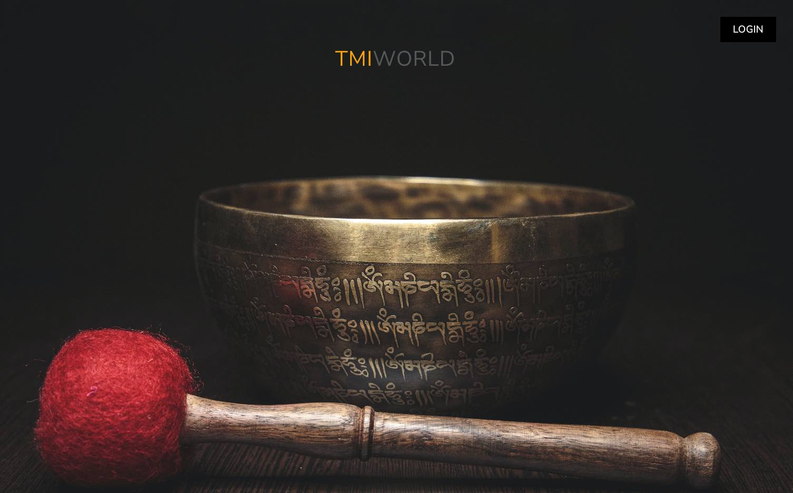
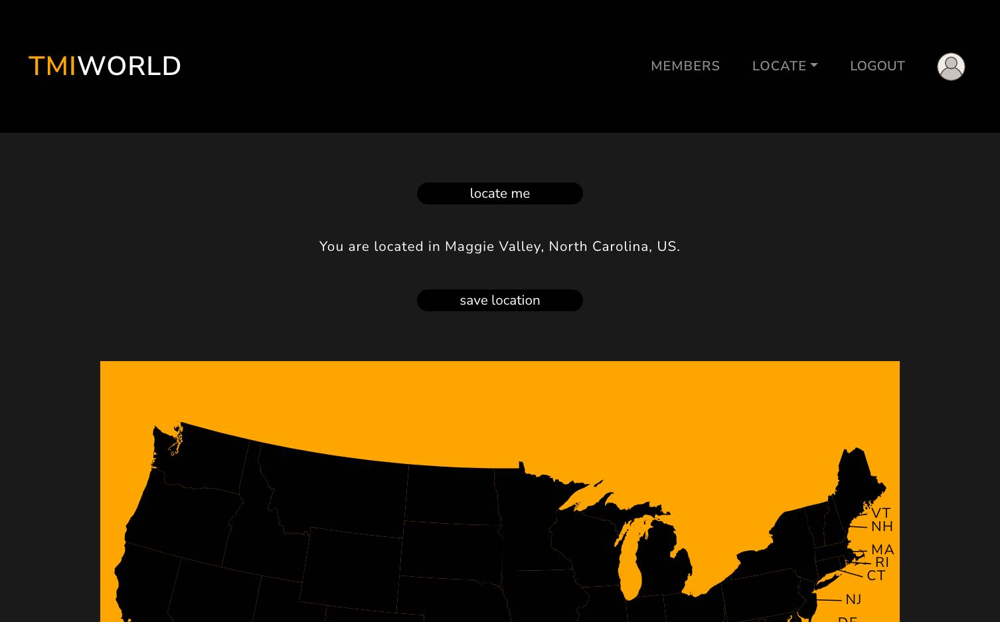

# TMIWORLD 

##### Link to [TMIWORLD](https://tmiworld-5f7c04c2f838.herokuapp.com/) (MERN + GraphQl + Firebase web site).

---

### Description

This website has been designed to bring together meditators from all around the world who are following "The Mind Illuminated," authored by Culadasa (John Yates, PhD) and Matthew Immergut, PhD.

The primary features of this application include geolocating users using the OpenWeather API and allowing users to request contact with other practitioners. Unlike traditional social media platforms, our focus is on fostering connections centered around meditation. Once a friendship has been established, email addresses are displayed, enabling users to continue their interactions on their preferred social media platforms.

Create, get, update and delete queries and mutations operations can be performed on user, profile and location. create, get and delete on requests and contacts.

## Table of Contents

- [Technologies](#technologies)
- [Installation](#installation)
- [Visuals](#visuals)
- [Contributing](#contributing)
- [Questions](#questions)
- [Future development](#future-development)
- [Questions](#questions)

## Technologies

- `Mongoose and MongoDB`
- `Express.js`
- `React`
- `Axios`
- `Node.js`
- `GraphQL`
- `Apollo-server-express`
- `React-simple-maps`
- `Bootstrap`
- `Bootswatch`
- `Jwt-decode`
- `Jsonwebtoken`
- `Bcrypt`
- `Firebase` (to store profile pictures).

## Installation
Clone the reposatory.
`npm install`.
 `npm run develop`. (Concurrently starts client and server).

## Visuals

- Landing Page

- Dashboard/members list

## Future developpment

- Error 404 page.
- Add the "TMI" headquarter on the US map.
- Optimize the application for maximum speed and scalability.
- Keep on refactoring code.
- Add comments.

## Contributing

A great thank you to 'Stack Overflow' and all it's participants as well as 'Google' which helped tremendously for resources and troubleshooting. Thank you to Unsplash for fantastic pictures.

## Questions

If you have any questions or wish to contact me please visit the app's [Sy25](https://github.com/Saidou25).